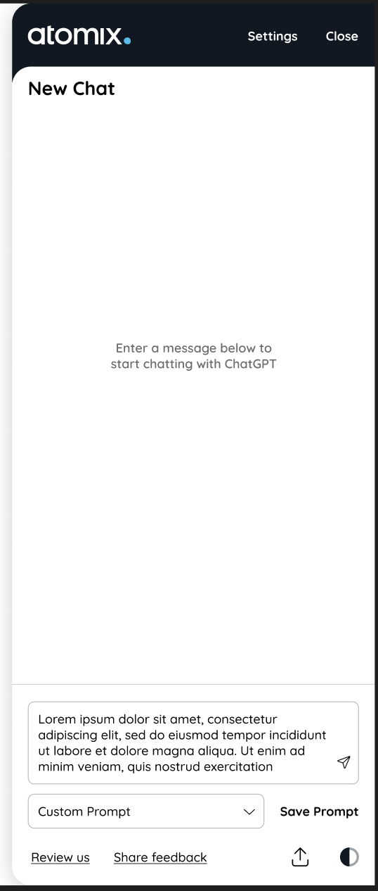

# Atomix ChatGPT Chrome Extension (MV3) with React 18, Webpack 5, and MUIv5, Typescript



## Features

This is an Atomix Chrome Extension that wrap arounds ChatGPT, providing additional features while improving the accessibility of the chatbot on Chrome browser as a sidebar.

- [Chrome Extension Manifest V3](https://developer.chrome.com/docs/extensions/mv3/intro/mv3-overview/)
- [React 18](https://reactjs.org)
- [Webpack 5](https://webpack.js.org/)
- [Webpack Dev Server 4](https://webpack.js.org/configuration/dev-server/)
- [React Refresh](https://www.npmjs.com/package/react-refresh)
- [react-refresh-webpack-plugin](https://github.com/pmmmwh/react-refresh-webpack-plugin)
- [eslint-config-react-app](https://www.npmjs.com/package/eslint-config-react-app)
- [TypeScript](https://www.typescriptlang.org/)
- [Mui 5](https://mui.com/material-ui/getting-started/overview/)

### Procedures:

1. Check if your [Node.js](https://nodejs.org/) version is >= **18**.
2. Clone this repository.
3. Add fontawesome pro token via `.npmrc` file
4. Run `yarn install` to install the dependencies.
5. Run `yarn build` or `yarn dev` for hot-reload dev mode
6. Load your extension on Chrome following:
   1. Access `chrome://extensions/`
   2. Check `Developer mode`
   3. Click on `Load unpacked extension`
   4. Select the `build` folder.
## Structure

All the extension's code is placed in the `src` folder. The chrome extensions after built is in the `build` folder.

## TypeScript

This boilerplate now supports TypeScript! The `Options` Page is implemented using TypeScript. Please refer to `src/pages/Options/` for example usages.

## Webpack auto-reload and HRM

To make your workflow much more efficient this boilerplate uses the [webpack server](https://webpack.github.io/docs/webpack-dev-server.html) to development (started with `npm start`) with auto reload feature that reloads the browser automatically every time that you save some file in your editor.

You can run the dev mode on other port if you want. Just specify the env var `port` like this:

```
$ PORT=6002 yarn run start
```

## Content Scripts

Content script starting points is on your extension manifest, to your bundles that you want to use as [content scripts](https://developer.chrome.com/extensions/content_scripts), but you need to exclude these entry points from hot reloading [(why?)](https://github.com/samuelsimoes/chrome-extension-webpack-boilerplate/issues/4#issuecomment-261788690). To do so you need to expose which entry points are content scripts on the `webpack.config.js` using the `chromeExtensionBoilerplate -> notHotReload` config. Look the example below.

Let's say that you want use the `myContentScript` entry point as content script, so on your `webpack.config.js` you will configure the entry point and exclude it from hot reloading, like this:

```js
{
  …
  entry: {
    myContentScript: "./src/js/myContentScript.js"
  },
  chromeExtensionBoilerplate: {
    notHotReload: ["myContentScript"]
  }
  …
}
```

and on your `src/manifest.json`:

```json
{
  "content_scripts": [
    {
      "matches": ["https://www.google.com/*"],
      "js": ["myContentScript.bundle.js"]
    }
  ]
}
```

## Packing

After the development of your extension run the command

```
$ NODE_ENV=production yarn build
```

Now, the content of `build` folder will be the extension ready to be submitted to the Chrome Web Store. Just take a look at the [official guide](https://developer.chrome.com/webstore/publish) to more infos about publishing.

## Secrets

If you are developing an extension that talks with some API you probably are using different keys for testing and production. Is a good practice you not commit your secret keys and expose to anyone that have access to the repository.

This code import the file `./secrets.<THE-NODE_ENV>.js` on your modules through the module named as `secrets`, so you can do things like this:

_./secrets.development.js_

```js
export default { key: '123' };
```

_./src/popup.js_

```js
import secrets from 'secrets';
ApiCall({ key: secrets.key });
```

:point_right: The files with name `secrets.*.js` already are ignored on the repository.

## Resources:

- [Webpack documentation](https://webpack.js.org/concepts/)
- [Chrome Extension documentation](https://developer.chrome.com/extensions/getstarted)

---
## Credit:

React Chrome Extension Boiler Plate Template:
- Michael Xieyang Liu | [Website](https://github.com/lxieyang/chrome-extension-boilerplate-react)
